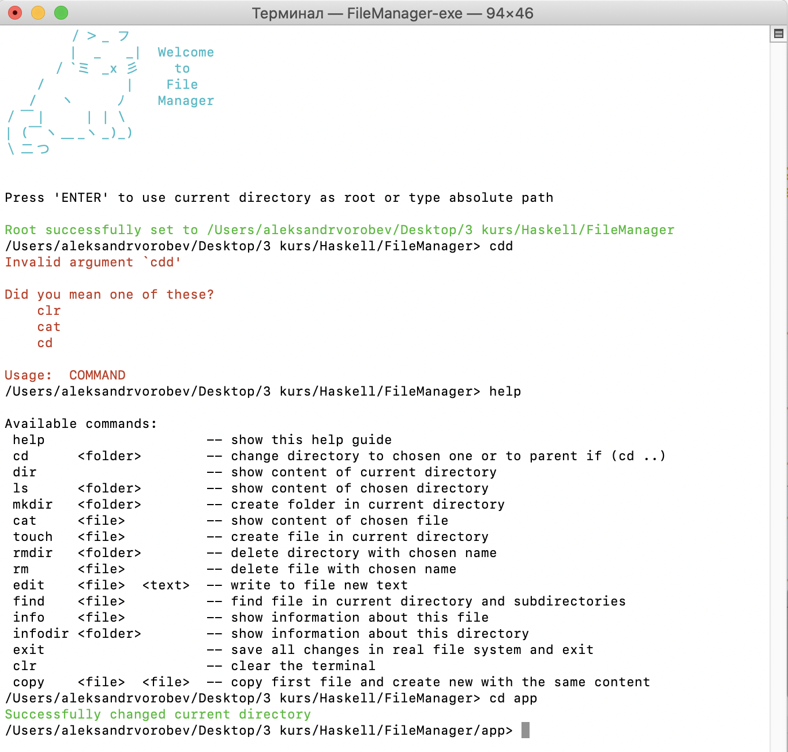

# File Manager



File manager that allows to work with the file system in its pure form.

Functionality:

1. command line interface ;
2. navigate through directories;
3. show the contents of the current directory;
4. create a folder/file;
5. to display the contents of the file;
6. delete a folder/file;
7. write text information to a file;
8. search for a file by name in the current directory and its subdirectories and output the path to the file;
9. display information about a given file:
  - the way;
  - access rights;
  - file type;
  - time of creation and / or modification;
  - size;
10. to display information about directory:
  - size;
  - the way;
  - number of files inside;
  - access rights;

Example:
```
$ my-best-file-manager ~/
/users/my_user/ > help
cd <folder> -- go to directory
dir -- show the contents of the current directory
ls <folder> -- show the contents of the selected directory
create-folder "folder-name" -- create a directory in the current folder
cat <file> -- show file contents
create-file "file-name" -- create an empty file in the current directory
remove <folder | file> -- delete the selected directory or file
write-file <file> "text" -- write text to a file
find-file "file-name" -- search for a file in the current directory and subdirectories
information <file> -- show information about the file
information <folder> -- show directory information
help -- show usage guide
exit -- program shutdown


/users/my_user/ > cd folder-that-exist
/users/my_user/folder-that-exist > dir
a
b
c
/users/my_user/folder-that-exist > ls a
a is not a folder
/users/my_user/folder-that-exist > cat a
aaaaaa
/users/my_user/folder-that-exist > cd no-folder
no-folder does not exist
/users/my_user/folder-that-exist > create-file d
/users/my_user/folder-that-exist > dir
a
b
c
d
/users/my_user/folder-that-exist > exit
```
